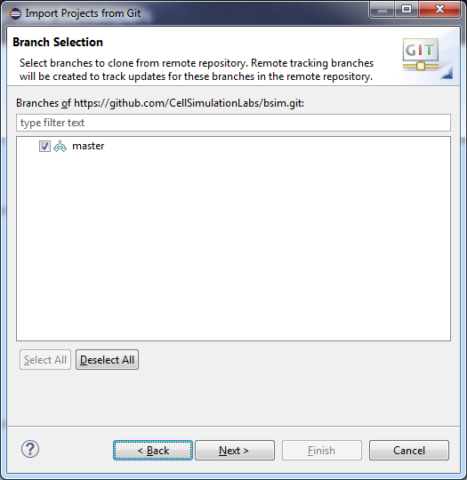
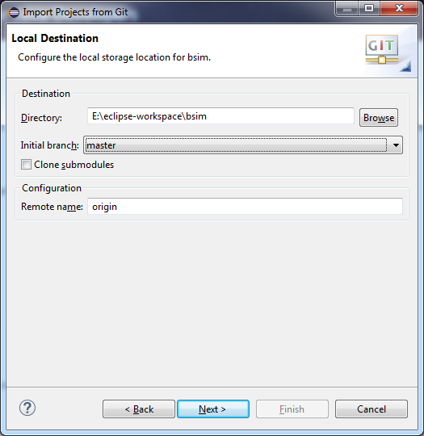
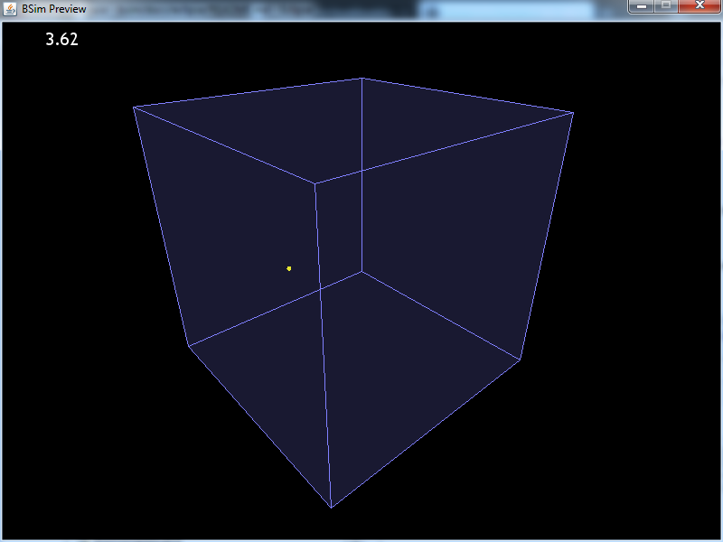

# Installation and set-up using eclipse

This guide has been written using eclipse 4.7.0 (Oxygen).

## Installation options

### 1. Directly clone in eclipse and create a new project

See instructions [below](#clone-inside-eclipse).

### 2. Manually clone the repository

If you want to check out the repository locally, you can get it directly from here (https://github.com/CellSimulationLabs/bsim) using git through the terminal, e.g., with ssh
`git clone git@github.com:CellSimulationLabs/bsim.git`
or https
`git clone https://github.com/CellSimulationLabs/bsim.git`
and then set up a project in eclipse, using the directory you cloned the repository into as the project root.

## Clone inside eclipse

1. From the welcome screen, click `checkout projects from git`:

2. Select the `clone URI` option (unless you have locally cloned the repo already, of course; in that case you can skip to creating a java project from the repo):

3. Enter the URI for the repo:

4. Select the master branch:

5. Configure the directory into which you want to clone the files. Here, I am cloning it directly into the eclipse workspace:

6. Import the project using the new project wizard:

7. The type of the project should be `new java project`:

8. On the next screen, set the project name to the name of the repo folder, if the repo has been cloned into the workspace. Otherwise you will have to navigate to the directory you cloned the repo to. In the case where the repo was cloned into the eclipse workspace, all the default settings here ought to be fine:

9. On the next screen, configure the project build settings. You need to _remove_ `src` and `src/bsim` from the project sources in the Source tab. Then, you need to _add_ `src`. Finally, change the build directory to `bsim/out`. The layout should look like this:

10. Remove extraneous libraries (the stuff in `legacy` dir that is automatically added by eclipse). The libraries tab ought to look like this:

11. Finally, after clicking `finish`, the project should have been created. It ought to be in your workspace:

12. If you right click the project, and open the properties, you should see the following set-up for the build path:

13. OK. Everything should be set up to go. To test that things are working correctly, navigate to `bsim -> examples -> BSimSimplest`, right click `BSimSimplest`, select `run as -> java application` and you should be greeted by a window with a yellow bacterium swimming around:

